

  

SRE by day, homelab addict by night. I build, break, and automate infrastructure for a living and keep doing it when I get home because I genuinely enjoy it. 
My homelab runs a full self-hosted stack: Proxmox, Kubernetes, monitoring, security... This GitHub is where I version everything. 
Outside of tech: one-trick Kha'Zix in League, Reyna main in Valorant, CTFs, anime, sport shooting and traveling.

## 🌐 Socials
 
 

 

## 🏅 Certifications
<table>
  <tr>
    <td align="center"></td>
    <td align="center"></td>
    <td align="center">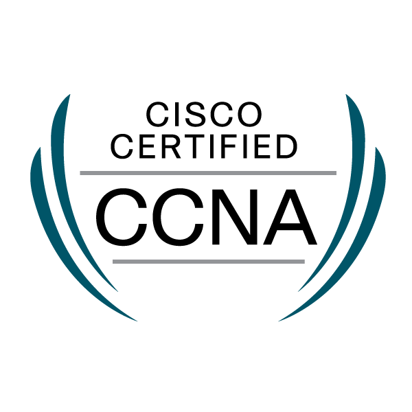</td>
  </tr>
  <tr>
    <td align="center">CKA</td>
    <td align="center">AWS SAA-C03</td>
    <td align="center">CCNA</td>
  </tr>
</table>

 

## 💻 Tech Stack

#### Operating Systems & Shell
<table>
  <tr>
    <td align="center"></td>
    <td align="center">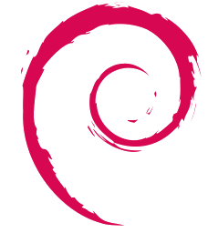</td>
    <td align="center"></td>
    <td align="center">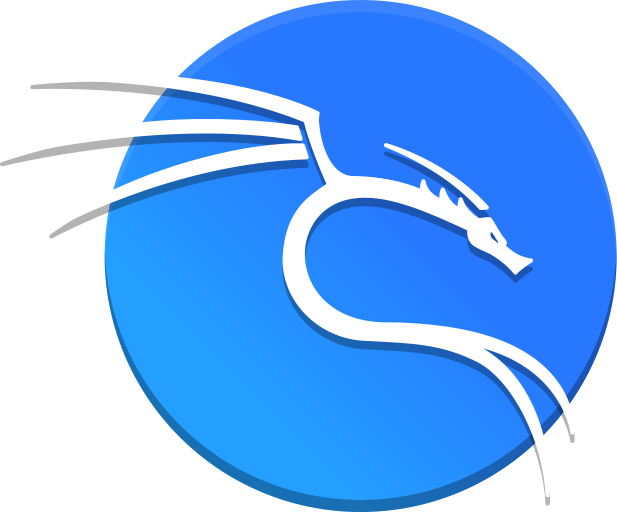</td>
    <td align="center">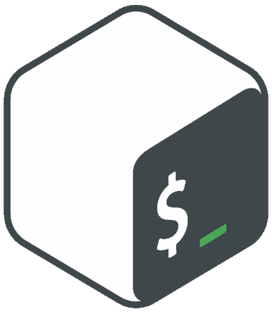</td>
  </tr>
  <tr>
    <td align="center">Linux</td>
    <td align="center">Debian</td>
    <td align="center">Ubuntu</td>
    <td align="center">Kali Linux</td>
    <td align="center">Bash</td>
  </tr>
</table>

---

#### Development
<table>
  <tr>
    <td align="center">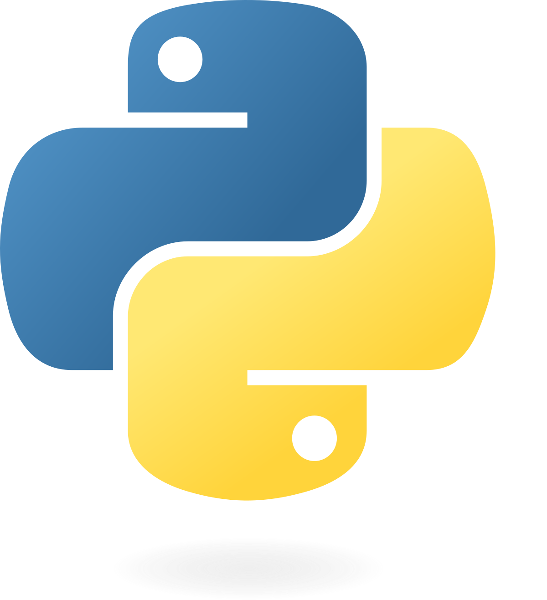</td>
    <td align="center"></td>
    <td align="center">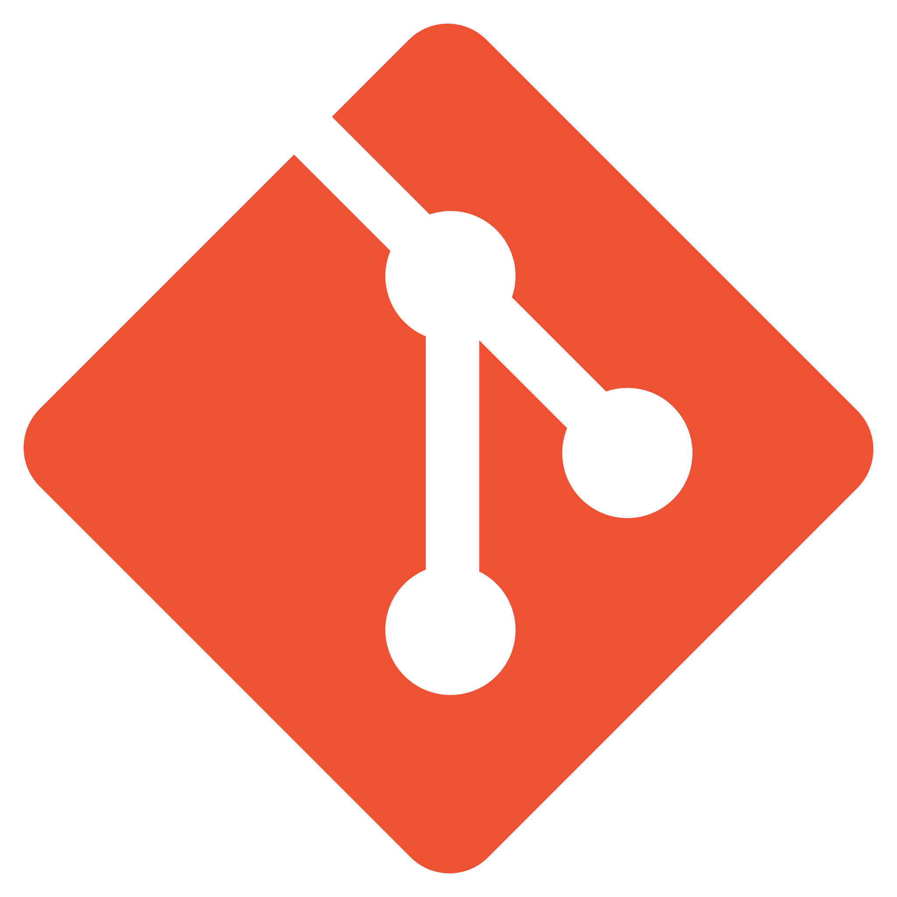</td>
    <td align="center">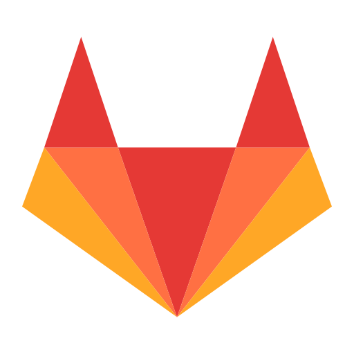</td>
    <td align="center"></td>
  </tr>
  <tr>
    <td align="center">Python</td>
    <td align="center">FastAPI</td>
    <td align="center">Git</td>
    <td align="center">GitLab</td>
    <td align="center">GitHub</td>
  </tr>
</table>

---

#### Containerization & Orchestration
<table>
  <tr>
    <td align="center"></td>
    <td align="center"></td>
    <td align="center"></td>
    <td align="center">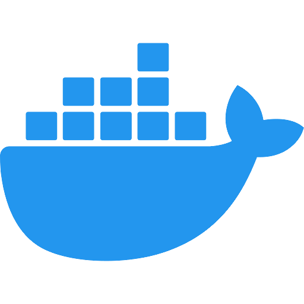</td>
    <td align="center">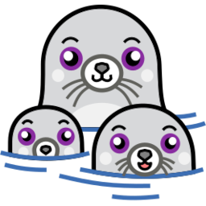</td>
  </tr>
  <tr>
    <td align="center">Kubernetes</td>
    <td align="center">Helm</td>
    <td align="center">ArgoCD</td>
    <td align="center">Docker</td>
    <td align="center">Podman</td>
  </tr>
</table>

---

#### Automation & IaC
<table>
  <tr>
    <td align="center">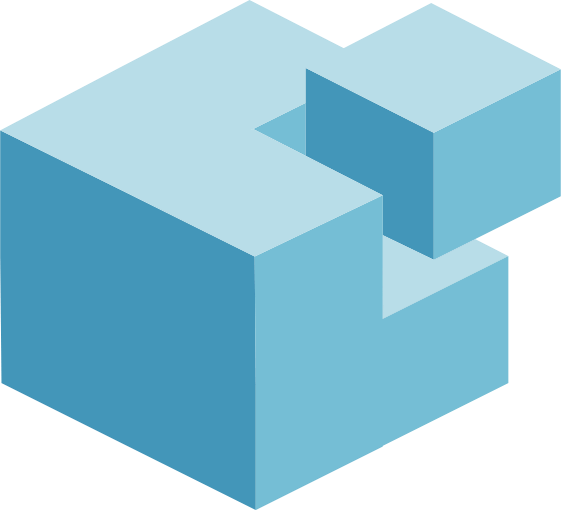</td>
    <td align="center"></td>
    <td align="center"></td>
    <td align="center"></td>
    <td align="center"></td>
  </tr>
  <tr>
    <td align="center">SaltStack</td>
    <td align="center">Ansible</td>
    <td align="center">StackStorm</td>
    <td align="center">Terraform</td>
    <td align="center">Pulumi</td>
  </tr>
</table>

---

#### Virtualization & Cloud Infrastructure
<table>
  <tr>
    <td align="center"></td>
    <td align="center">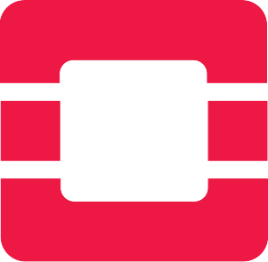</td>
    <td align="center"></td>
    <td align="center"></td>
  </tr>
  <tr>
    <td align="center">Proxmox</td>
    <td align="center">OpenStack</td>
    <td align="center">Nutanix</td>
    <td align="center">VMware</td>
  </tr>
</table>

---

#### Cloud Providers
<table>
  <tr>
    <td align="center"></td>
    <td align="center"></td>
    <td align="center"></td>
    <td align="center"></td>
    <td align="center">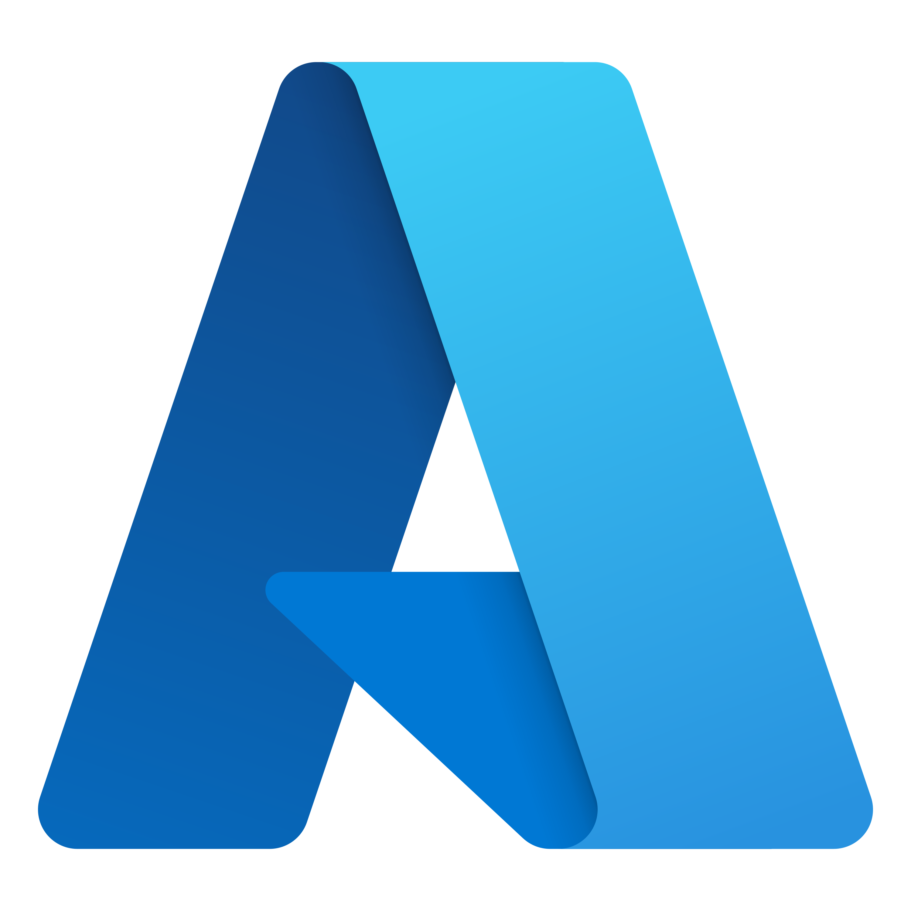</td>
    <td align="center"></td>
  </tr>
  <tr>
    <td align="center">AWS</td>
    <td align="center">Scaleway</td>
    <td align="center">Infomaniak</td>
    <td align="center">OVH</td>
    <td align="center">Azure</td>
    <td align="center">GCP</td>
  </tr>
</table>

---

#### Network Infrastructure
<table>
  <tr>
    <td align="center">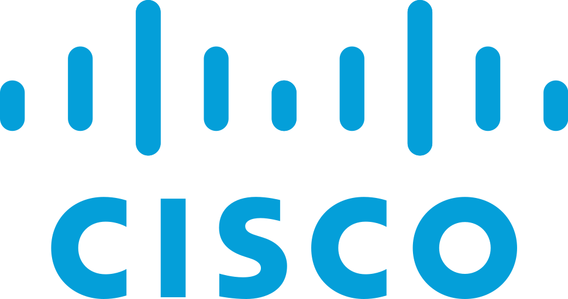</td>
    <td align="center">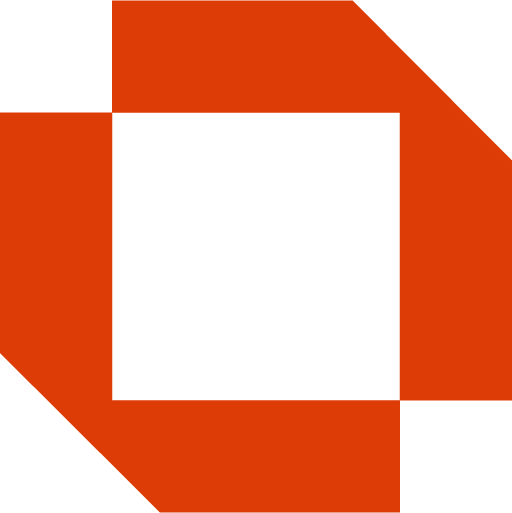</td>
    <td align="center">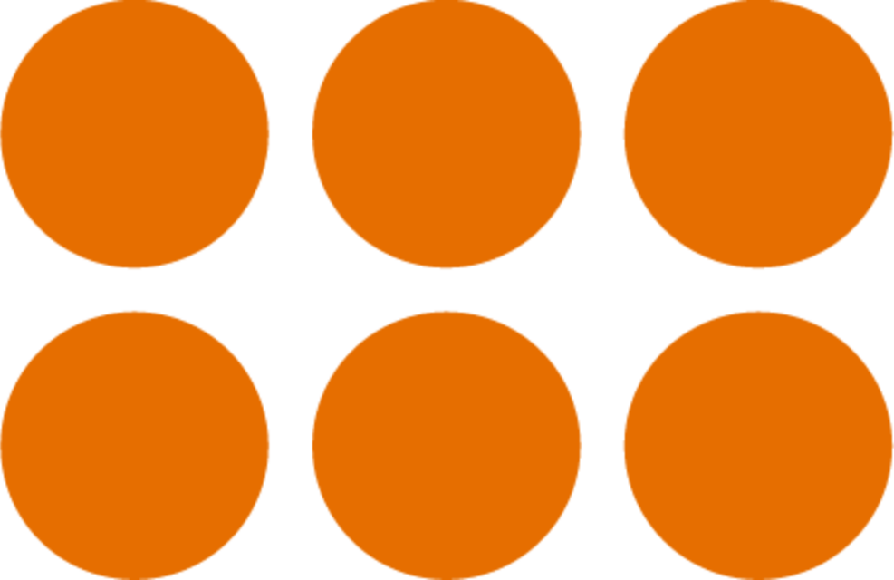</td>
    <td align="center"></td>
  </tr>
  <tr>
    <td align="center">Cisco</td>
    <td align="center">OPNsense</td>
    <td align="center">PowerDNS</td>
    <td align="center">MetalLB</td>
  </tr>
</table>

---

#### Reverse Proxy & Load Balancing
<table>
  <tr>
    <td align="center">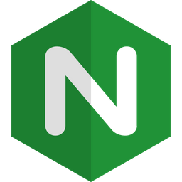</td>
    <td align="center">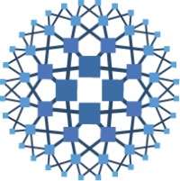</td>
    <td align="center"></td>
    <td align="center">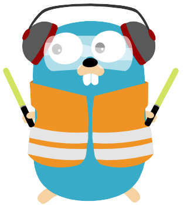</td>
    <td align="center">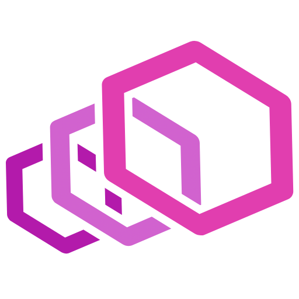</td>
  </tr>
  <tr>
    <td align="center">Nginx</td>
    <td align="center">HAProxy</td>
    <td align="center">KeepAlived</td>
    <td align="center">Traefik</td>
    <td align="center">Envoy Proxy</td>
  </tr>
</table>

---

#### Security
<table>
  <tr>
    <td align="center"></td>
    <td align="center">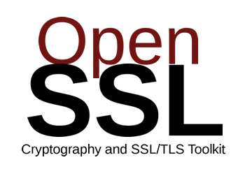</td>
    <td align="center"></td>
    <td align="center"></td>
    <td align="center"></td>
    <td align="center"></td>
    <td align="center"></td>
  </tr>
  <tr>
    <td align="center">Vault</td>
    <td align="center">OpenSSL</td>
    <td align="center">WireGuard</td>
    <td align="center">CrowdSec</td>
    <td align="center">Wazuh</td>
    <td align="center">Cilium</td>
    <td align="center">Tetragon</td>
  </tr>
</table>

---

#### Monitoring & Observability
<table>
  <tr>
    <td align="center"></td>
    <td align="center"></td>
    <td align="center"></td>
    <td align="center">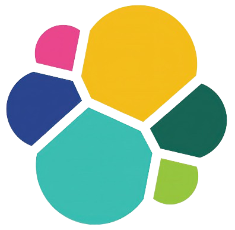</td>
    <td align="center"></td>
    <td align="center">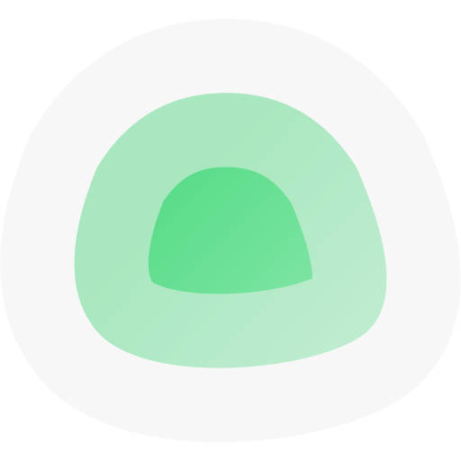</td>
  </tr>
  <tr>
    <td align="center">Prometheus</td>
    <td align="center">Grafana</td>
    <td align="center">VictoriaMetrics</td>
    <td align="center">ELK Stack</td>
    <td align="center">SigNoz</td>
    <td align="center">Uptime Kuma</td>
  </tr>
</table>

---

#### Databases
<table>
  <tr>
    <td align="center"></td>
    <td align="center"></td>
    <td align="center"></td>
    <td align="center">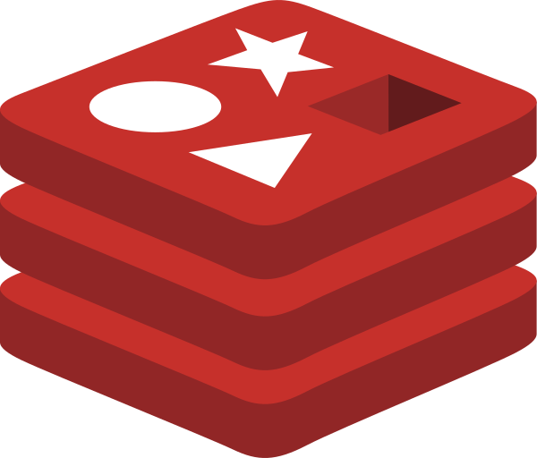</td>
    <td align="center"></td>
  </tr>
  <tr>
    <td align="center">MySQL</td>
    <td align="center">MariaDB</td>
    <td align="center">PostgreSQL</td>
    <td align="center">Redis</td>
    <td align="center">ClickHouse</td>
  </tr>
</table>

---

#### Artifact Registries & Tools
<table>
  <tr>
    <td align="center">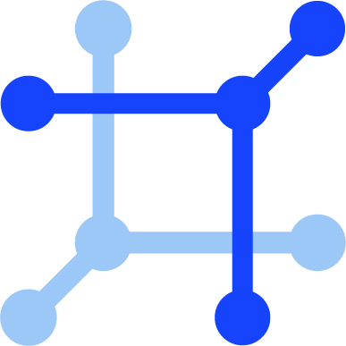</td>
    <td align="center">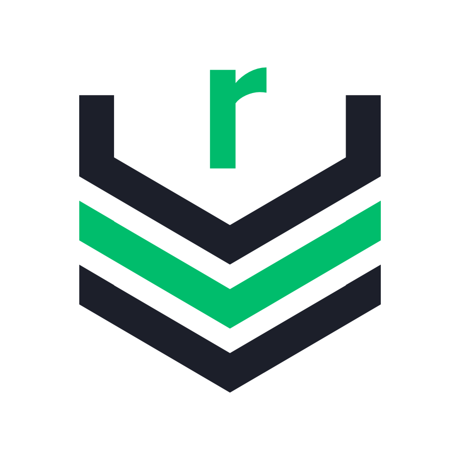</td>
    <td align="center"></td>
  </tr>
  <tr>
    <td align="center">NetBox</td>
    <td align="center">Nexus OSS</td>
    <td align="center">Harbor</td>
  </tr>
</table>
